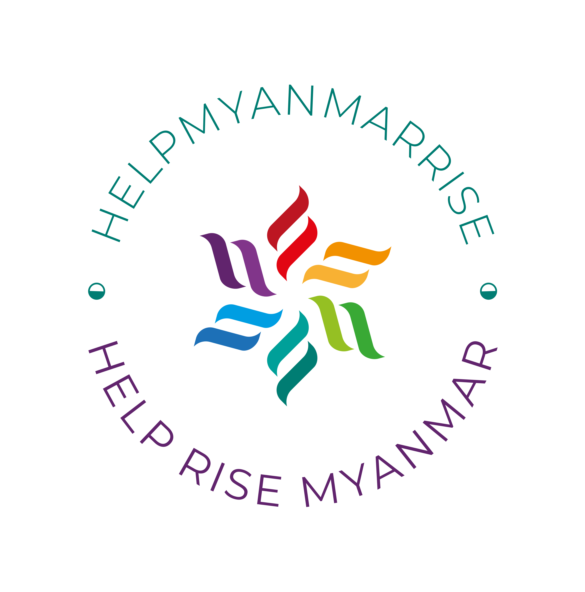

# 🌏 Help Myanmar Rise - Earthquake Relief and Recovery Tracker



**Help Myanmar Rise** is a community-driven platform designed to assist in earthquake relief efforts in Myanmar. This project provides real-time tracking of resource needs, donation campaigns, and news updates to help coordinate aid and recovery efforts effectively.

---

## 🚀 Features

- **Real-Time Resource Tracking**: Submit and view resource needs across affected regions.
- **Interactive Map**: Visualize resource needs and reports on a map powered by Mapbox.
- **News Updates**: Stay informed with the latest news articles about the earthquake and relief efforts.
- **Donation Campaigns**: Discover and contribute to trusted donation campaigns.
- **Multilingual Support**: Switch between English and Burmese (မြန်မာစာ) for accessibility.
- **Community Contributions**: Verified organizations can submit resource needs to help coordinate relief efforts.

---

## 🎯 Purpose

The goal of this project is to provide a centralized platform for earthquake relief coordination in Myanmar. By connecting donors, volunteers, and organizations, we aim to:

- Improve the efficiency of resource distribution.
- Raise awareness about ongoing relief efforts.
- Provide transparency and accountability in disaster response.

This project is **open-source** and welcomes contributions from developers, designers, and community members who want to make a difference.

---

## 💻 Technology Stack

- **Frontend**:

  - Next.js (React framework)
  - Tailwind CSS
  - TypeScript
  - React Query for data fetching

- **Backend**:

  - Node.js
  - Express.js
  - MongoDB (database)
  - Mongoose (ODM)

- **APIs & Services**:

  - Mapbox for interactive maps
  - Google Translate API for multilingual support
  - GNews API for news updates
  - Render for deployment

- **Authentication**:
  - NextAuth.js

---

## 🛠️ Installation and Setup

Follow these steps to set up the project locally:

### Prerequisites

- [Node.js](https://nodejs.org/) (v16 or higher)
- [MongoDB](https://www.mongodb.com/) (for backend database)
- [Mapbox API Key](https://www.mapbox.com/) (for map functionality)
- [Google Translate API Key](https://cloud.google.com/translate) (for translation)
- [GNews API Key](https://gnews.io/) (for fetching news articles)

### Clone the Repository

```bash
git clone https://github.com/RiseMyanmar/RiseMyanmarWeb.git
cd RiseMyanmarWeb
```

### Environment Setup

1. Create a `.env.local` file in the root directory
2. Add the following environment variables:

```
NEXT_PUBLIC_MAPBOX_TOKEN=your_mapbox_token
NEXT_PUBLIC_GOOGLE_TRANSLATE_API_KEY=your_google_translate_api_key
NEXT_PUBLIC_GNEWS_API_KEY=your_gnews_api_key
MONGODB_URI=your_mongodb_connection_string
NEXTAUTH_SECRET=your_nextauth_secret
NEXTAUTH_URL=http://localhost:3000
```

### Install Dependencies

```bash
npm install
# or
yarn
```

### Start Development Server

```bash
npm run dev
# or
yarn dev
```

The application will be available at [http://localhost:3000](http://localhost:3000)

---

## 🤝 How to Contribute

We welcome contributions from developers of all skill levels! Here's how you can contribute:

### 1. Find an Issue to Work On

- Check our [GitHub Issues](https://github.com/RiseMyanmar/RiseMyanmarWeb/issues) for open tasks
- Look for issues tagged with `good first issue` if you're new to the project

### 2. Fork and Clone the Repository

```bash
git clone https://github.com/RiseMyanmar/RiseMyanmarWeb.git
cd RiseMyanmarWeb
```

### 3. Create a New Branch

```bash
git checkout -b feature/your-feature-name
```

### 4. Make Your Changes

- Follow the coding style and guidelines
- Write tests for your code when applicable
- Ensure your code is well-documented

### 5. Commit and Push Your Changes

```bash
git add .
git commit -m "Add your meaningful commit message here"
git push origin feature/your-feature-name
```

### 6. Create a Pull Request

- Go to your fork on GitHub
- Click on "New Pull Request"
- Select your branch and submit the PR with a clear description of your changes

---

## 🙏 Acknowledgments

- All the volunteers and contributors
- Organizations working on the ground in Myanmar

---

## 📜 License

This project is licensed under the MIT License - see the [LICENSE](LICENSE) file for details.
